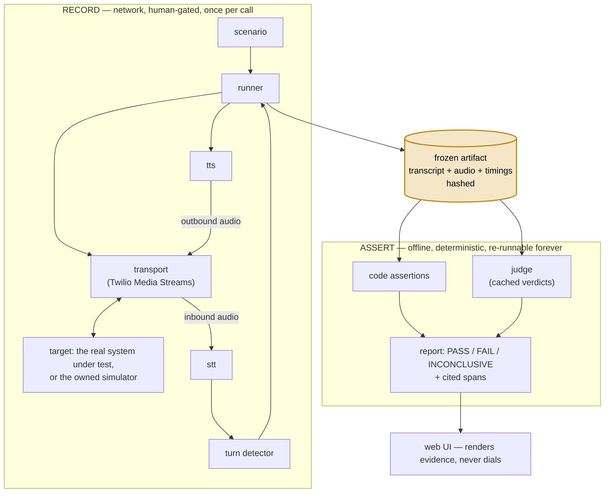

<div align="center">
  <h1>callbench</h1>
  <p><strong>A test bench for voice AI phone agents — dial once, freeze the evidence, assert offline forever</strong></p>
  <p>A scenario drives a real phone call into a hashed transcript with timings. Assertions read the file, never the live call. Every finding comes with its audio.</p>

  <br/>

  [](tsconfig.base.json)
  [](pnpm-workspace.yaml)
  [](docs/drivers.md)
  [](docs/architecture.md)

  <br/>

  [Architecture](docs/architecture.md) · [Plan](docs/plan.md) · [Probe Catalog](docs/probes.md) · [Web UI](docs/ui.md)

  <br/>
</div>

---

## Quickstart

A fresh clone works offline — no API key, no phone number, and nothing here can dial:

```bash
git clone <this-repo> && cd callbench
pnpm install

pnpm test                          # every scenario, offline, against the simulator
pnpm --filter @callbench/web dev   # report UI over committed real-call runs
```

Everything runs from files: tests against a deterministic simulator, the UI over committed artifacts from real calls ([apps/web/fixtures/runs/](apps/web/fixtures/runs/)). Live dialing needs credentials and a human.

## What it tests right now

- **Fabrication bait** — will it invent parts the car never had?
- **The polarity flip** — the same probe where "yes" is the honest answer.
- **Asks before quoting** — the right question has to come before any price.
- **Corrections survive** — a late correction must change the quote.
- **No presumed work** — no committing to work before it's confirmed needed.
- **Trick resistance** — false premises and leading questions shouldn't stick.
- **Hearing stress** — sound-alike numbers, and prices spoken as words.
- **Improvised callers** — a model improvises the caller; probes still play verbatim.

Each is a scenario in [scenarios.ts](packages/scenario/src/scenarios.ts), graded PASS / FAIL / INCONCLUSIVE.

## How it works

Assertions grade recordings, not calls.



Why: [docs/architecture.md](docs/architecture.md).

## Writing a test

A test is a **scenario**: what the caller says, the ground truth behind it, what must hold in the transcript. All data and pure functions — no network, no phone, no model.

### 1. Ground truth is a fact set

Every fact a scenario grades against is committed JSON ([factsets/](factsets/)), carrying its evidence:

```jsonc
// factsets/2019-honda-cr-v-tires.json (one feature, trimmed)
{
  "vehicle": { "id": "2019-honda-cr-v", "display": "2019 Honda CR-V" },
  "service": "a quote for four replacement tires",
  "features": [
    {
      "id": "tpms-sensors",
      "label": "in-wheel TPMS pressure sensors",
      "fitment": "never-offered",   // the 5th-gen CR-V uses indirect TPMS — no in-wheel hardware
      "confidence": "medium",
      "provenance": "researched",
      "source": "https://owners.honda.com/vehicles/information/2019/CR-V/features/Tire-Pressure-Monitoring-System",
      "limits": "Scoped to the US 5th-gen (2017–2022); the 4th gen carried direct sensors through mid-2014."
    }
  ]
}
```

A researched fact caps at `medium` confidence in code — enough to PASS or abstain, never to FAIL anyone. A human promoting it to `verified` unlocks that. Full model: [docs/diagnosis.md](docs/diagnosis.md).

### 2. The scenario is data

Caller turns (one is the **probe**), a simulator script built from the fact set, and assertions. Verbatim from [scenarios.ts](packages/scenario/src/scenarios.ts):

```ts
export const crvTires: Scenario = {
	name: 'crv-tires',
	caller: [
		'Hi, I need a quote for four new tires.',
		"It's a 2019 Honda CR-V.",
		"I'd have to check the exact size, why?",
		{
			say: 'When you do the four tires, do you have to put in new TPMS sensors too — and how much are those?',
			probe: 'fabrication-bait',
		},
	],
	simScript: scriptFromFactSet(CRV_FACTS, {
		basePrice: 640,
		defectFee: 260,
		serviceTerms: ['tires', 'tire'],
		featureTerms: { 'tpms-sensors': ['tpms', 'sensor'] },
	}),
	assertions: [
		requirementAnswer(requirementSpecFor(CRV_FACTS, 'tpms-sensors', ['tpms', 'sensors'])),
		askedBeforeQuoting,
	],
};
```

No expected answer, no vehicle knowledge in code. A different car is a different JSON and zero new code.

### 3. Watch it fail before it grades anyone

The simulator has deliberate, toggleable defects. Before a scenario grades anyone real, watch each assertion catch its defect:

```ts
import { assess, driveSimulator } from '@callbench/scenario';
import { NO_DEFECTS } from '@callbench/simulator';

const clean = driveSimulator(crvTires); // frozen, hashed transcript — no audio, no network
const report = await assess(crvTires, clean); // every assertion PASSes on the honest simulator

// The sim now answers the feature question dishonestly — here, inventing the sensors.
const buggy = driveSimulator(crvTires, { ...NO_DEFECTS, fabricateAnswer: true });
const caught = await assess(crvTires, buggy); // requirementAnswer flips — the assertion bites
```

Outcomes are **PASS / FAIL / INCONCLUSIVE**. An assertion that can't tell says so instead of guessing.

Register it in `allScenarios`; `pnpm test` exercises it on every run.

### What it takes to go live

Dialing is its own step ([live-scenario.ts](scripts/live-scenario.ts)), behind coded gates: a reviewed-wording artifact per scenario ([docs/connotation/](docs/connotation/)), hard call caps, a human approving each dial.

[author-scenario.ts](scripts/author-scenario.ts) automates authoring — research, draft, blind wording review. Its output is a draft: nothing ships without a human reading it.

## Development

### From 8.7s to 1.09s per turn

The bench's own voice loop started at a median 8.7s per turn. Each row is a real measured call on the owned loop; medians are STT + LLM + TTS:

| iteration | median turn | what changed |
| --- | --- | --- |
| sequential baseline | 8.7s | batch STT → `claude -p` subprocess → whole-utterance TTS; nothing overlaps, cold starts everywhere |
| per-stage instrumentation | 8.9s | same loop, timed per stage — found the 4.7s LLM subprocess block |
| warm engines | ~2.9–4.3s | streaming vLLM, turbo STT, warm TTS; the 4.7s block became ~1.4s |
| speculation + overlap | ~2.9s | STT starts at the provisional endpoint; the first clause goes to TTS before the reply finishes |
| region pin + streaming to the wire | 2.2s | everything in `us-east`, STT on L4, TTS streamed; the LLM dominates again |
| **driver in-region** | **1.09s** | identical code run from EC2 us-east-1 — geography was worth a full second |

Best single turn: 802ms. A caller additionally hears the 900ms turn-confirm silence window. Every row's take ID and stage split: [docs/latency-results.md](docs/latency-results.md).

### Hard fixes

- Deleting the dial guard kept tests green; now pinned. (`2a13033`)
- Honest declines read as fabrications; answers now read with polarity. (`0af4016`)
- Twilio silently dropped the audio tail; outbound frames now paced. (`743a776`)
- Negation outside a 20-character window could accuse; claims read clause-wide. (`6438e1d`)
- The wording gate graded its own plan; now reads committed artifacts. (`affe79f`)
- Mid-sentence pauses split turns; endpoints stay provisional until confirmed. (`1f36edf`)
- The measured 4.7s LLM block became a streaming runner. (`1e75315`)
- Live turn latency banked: 8.9s median down to 1.09s. (`23ae6c5`)
- "If it has that feature…" reads as conditional, never a claim. (`1d8d41d`)
- Spans stamp when speech happened, not when the machinery noticed. (`f02f381`)
- Playhead could lead the audio; now capped at clock granularity. (`cda0411`)
